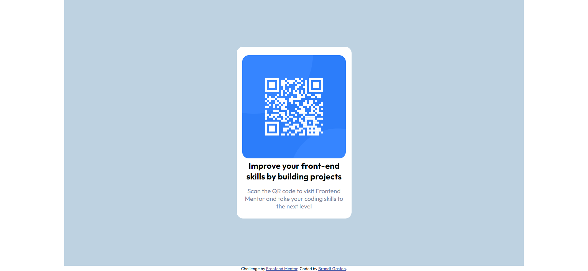

# Frontend Mentor - QR code component solution

This is a solution to the [QR code component challenge on Frontend Mentor](https://www.frontendmentor.io/challenges/qr-code-component-iux_sIO_H). Frontend Mentor challenges help you improve your coding skills by building realistic projects. 

## Table of contents

- [Overview](#overview)
  - [Screenshot](#screenshot)
  - [Links](#links)
- [My process](#my-process)
  - [Built with](#built-with)
  - [What I learned](#what-i-learned)
  - [Continued development](#continued-development)
  - [Useful resources](#useful-resources)
- [Author](#author)

## Overview

### Screenshot

### Links

- Solution URL: [Solution](https://github.com/Tonybrandt/qr-code-component)
- Live Site URL: [Add live site URL here](https://tonybrandt.github.io/qr-code-component/)

## My process

### Built with

- Semantic HTML5 markup
- CSS custom properties
- Flexbox
- Using media queries

### What I learned

I like doing these kinds of challenges to maintain and keep refreshing my basic knowledge of HTML and CSS.

### Continued development

From now on I would like to reinforce my knowledge in CSS Grid and also in creating good animations for my future projects.

### Useful resources

- [Resource 1](https://css-tricks.com/guides/) - This guide helps me whenever I have questions regarding with flex box and also in general with CSS.

## Author

- Website - [Brandt Gaston](#)
- Frontend Mentor - [@Tonybrandt](https://www.frontendmentor.io/profile/Tonybrandt)

